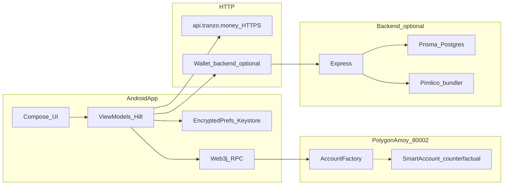
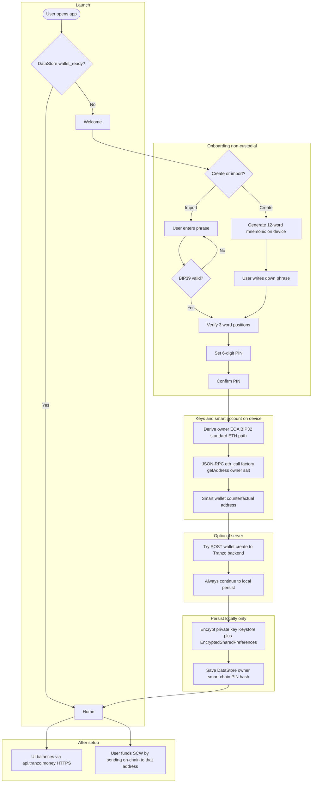
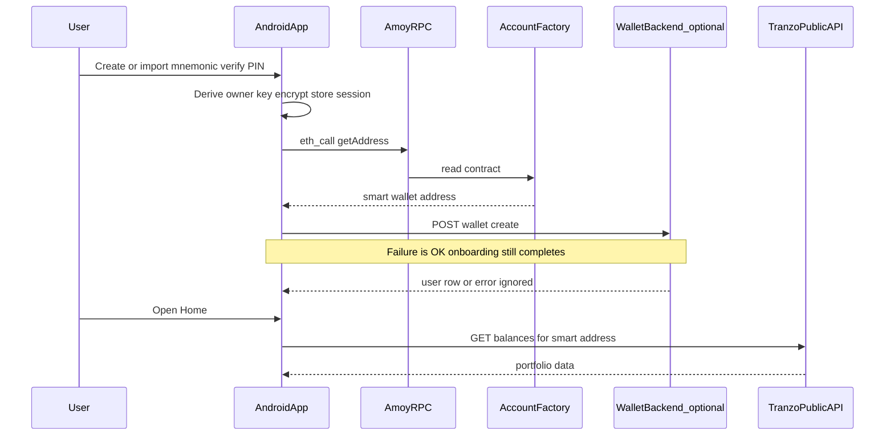

# Tranzo Custody — Technical Documentation

Tranzo Custody is a monorepo: **Android app** (Kotlin / Compose), **Node backend** (Express / Prisma), and **Foundry smart contracts** (ERC-4337–style account abstraction, paymaster, dripper). This README is the **engineering reference** for building, configuring, and operating the stack.

**Product:** [tranzo.money](https://tranzo.money) · **Contact:** connect@tranzo.money

---

## Table of contents

1. [Repository layout](#1-repository-layout)
2. [System architecture](#2-system-architecture) — [How it works (flow)](#21-how-it-works-flow)
3. [Android application](#3-android-application)
4. [Backend service](#4-backend-service)
5. [Smart contracts](#5-smart-contracts)
6. [CI/CD](#6-cicd)
7. [Local development checklist](#7-local-development-checklist)
8. [Security and operational notes](#8-security-and-operational-notes)
9. [Troubleshooting](#9-troubleshooting)

---

## 1. Repository layout

| Path | Purpose |
|------|---------|
| `app/` | Android application module (`com.tranzo.custody`) |
| `backend/` | Express API, Prisma ORM, Docker image |
| `smart_contracts/` | Foundry project (`forge build`, `forge test`) |
| `.github/workflows/main.yml` | CI: contracts, backend, Android |
| `gradle/`, `build.gradle.kts`, `settings.gradle.kts` | Root Gradle / Android build |
| `tranzo-debug.keystore` | Debug signing keystore (committed for reproducible debug builds; **not** for production stores) |
| `local.properties` | **Gitignored.** Must set `sdk.dir` for Android SDK (Android Studio creates this) |

Submodules: CI checks out **recursive submodules** for `smart_contracts/lib` (OpenZeppelin, forge-std, account-abstraction). Clone with:

```bash
git clone --recurse-submodules <repo-url>
# or after clone:
git submodule update --init --recursive
```

---

## 2. System architecture



- **Non-custodial keys:** 12-word mnemonic → BIP39/BIP32 (ETH path) → **owner EOA**; private key encrypted via **Android Keystore** + **EncryptedSharedPreferences** (`KeyStoreManager`).
- **Smart account address:** `TranzoAccountFactory.getAddress(owner, salt)` via **JSON-RPC `eth_call`** on Polygon Amoy. The app tries multiple public Amoy RPCs with timeouts (`SmartAccountManager`).
- **Optional wallet backend:** `POST /wallet/create` registers `ownerAddr` / `smartWalletAddr` in Postgres. If the call fails, onboarding can still complete using the **on-device** counterfactual address (`OnboardingViewModel`).
- **Public Tranzo API:** Balances and prices over HTTPS (`TranzoApi` base URL `https://api.tranzo.money/`).

### 2.1 How it works (flow)

End-to-end view: **what the user does**, **what stays on the phone**, and **what hits the network**. (Same idea as a typical Claude-style “explain the system” diagram.)





---

## 3. Android application

### 3.1 Requirements

- **JDK 17+** (Android Gradle Plugin 8.5.x)
- **Android SDK** with API 35; `compileSdk = 35`, `minSdk = 26`, `targetSdk = 35`
- **Android Studio** (recommended) or command-line Gradle

### 3.2 Build commands

```bash
./gradlew assembleDebug          # debug APK
./gradlew assembleRelease        # release (minify + shrink; needs keystore config)
```

Windows: `gradlew.bat` instead of `./gradlew`.

### 3.3 `BuildConfig` (see `app/build.gradle.kts`)

| Field | Typical value | Meaning |
|-------|----------------|--------|
| `WALLET_BACKEND_URL` | `http://10.0.2.2:3000/` | **Emulator** → host loopback. **Physical device:** use PC LAN IP, or `adb reverse tcp:3000 tcp:3000` and `http://127.0.0.1:3000/` |
| `ACCOUNT_FACTORY_ADDRESS` | `0x1b41BbeDAAeDAf82E9D4Bc25dB3DB6144eEbC4E6` | Factory on Amoy (must match deployed contract) |
| `DEFAULT_CHAIN_ID` | `80002` | Polygon Amoy |

### 3.4 Networking and security config

- **HTTPS** to `api.tranzo.money` uses default TLS.
- **HTTP** to local wallet backend:
  - `app/src/main/res/xml/network_security_config.xml` allows cleartext for `10.0.2.2`, `127.0.0.1`, `localhost`.
  - **`app/src/debug/res/xml/network_security_config.xml`** allows cleartext for **all** hosts in **debug** builds (so `http://192.168.x.x:3000/` works on a real phone).
- When `android:networkSecurityConfig` is set, manifest `usesCleartextTraffic` is **not** sufficient by itself; the XML rules apply.

### 3.5 Dependency highlights (`app/build.gradle.kts`)

- **UI:** Jetpack Compose (BOM 2024.09.03), Material 3, Navigation Compose 2.8.4
- **DI:** Hilt 2.51.1 + KSP
- **Persistence:** Room 2.6.1, DataStore Preferences 1.1.1
- **Crypto / wallet:** `androidx.security:security-crypto`, **web3j** `org.web3j:core:4.11.0` (Consensys Maven repo in `settings.gradle.kts` for transitive artifacts)
- **HTTP:** Retrofit 2.11, OkHttp 4.12, Gson converter
- **QR:** ZXing `core` 3.5.3

### 3.6 Package map (`app/src/main/java/com/tranzo/custody/`)

| Package | Responsibility |
|---------|----------------|
| `data/local/` | `UserSessionManager` (DataStore: wallet ready, addresses, chain, PIN hash) |
| `data/remote/` | `TranzoApi`, DTOs, `WalletBackendApi` (wallet create / userop) |
| `data/repository/` | `WalletRepositoryImpl`, portfolio / balances |
| `di/` | Hilt modules: `NetworkModule`, `Web3Module`, `DatabaseModule`, `@WalletBackendRetrofit` |
| `domain/` | Models, `WalletRepository` interface |
| `navigation/` | `Screen`, `TranzoNavigation`, nested onboarding graphs |
| `security/` | `KeyStoreManager` (AES-GCM, EncryptedSharedPreferences) |
| `web3/` | `MnemonicManager` (BIP39 + `Bip32ECKeyPair.deriveKeyPair`), `SigningManager`, `SmartAccountManager` |
| `ui/onboarding/` | Welcome, create/import seed, verify seed, set PIN |
| `ui/home/`, `ui/card/`, `ui/settings/`, etc. | Feature screens |

### 3.7 Onboarding and navigation (critical detail)

`OnboardingViewModel` must be **shared** across create → verify → PIN (and import → PIN). That is implemented with **nested navigation graphs** and `hiltViewModel(navController.getBackStackEntry(graphRoute))`:

- `onboarding_create`: `create_wallet` → `verify_seed` → `set_pin`
- `onboarding_import`: `import_wallet` → `set_pin`

Routes are defined in `navigation/Screen.kt`.

### 3.8 Web3 / RPC

- **Singleton `Web3j`** in `Web3Module` points at a public Amoy RPC (used e.g. for `getNonce`).
- **`computeCounterfactualAddress`** uses **separate** short-lived `Web3j` clients over a **fallback list** (`rpc-amoy.polygon.technology`, Ankr, drpc) with OkHttp timeouts (see `SmartAccountManager`).

### 3.9 ProGuard (`app/proguard-rules.pro`)

Keeps Retrofit, Gson, Room, Hilt, and wallet-backend DTO classes under `com.tranzo.custody.data.remote`.

---

## 4. Backend service

### 4.1 Stack

- **Runtime:** Node 20+, TypeScript, `tsx`/`ts-node-dev` for dev
- **HTTP:** Express 4, `helmet`, `cors`, JSON body
- **DB:** PostgreSQL via **Prisma 5**
- **On-chain:** `viem` (readContract, etc.)
- **Bundler:** Pimlico (`permissionless` client) for user operations

### 4.2 Scripts (`backend/package.json`)

```bash
cd backend
npm install --legacy-peer-deps
npx prisma generate
npx prisma migrate dev    # requires DATABASE_URL
npm run dev               # ts-node-dev src/index.ts
npm run build             # tsc → dist/
npm start                 # node dist/index.js
```

### 4.3 HTTP routes (mounted in `src/index.ts`)

| Mount | File | Endpoints (representative) |
|-------|------|----------------------------|
| `/wallet` | `routes/wallet.routes.ts` | `POST /wallet/create`, `POST /wallet/send-userop`, `GET /wallet/receipt/:chainId/:hash` |
| `/paymaster` | `routes/paymaster.routes.ts` | `POST /paymaster/sign` |
| root | `index.ts` | `GET /health` |

### 4.4 Environment variables

- **Source of truth:** `backend/src/config/env.ts`
- **Template:** `backend/.env.example` (copy to `backend/.env`; `.env` is gitignored)

**Behavior:**

- `NODE_ENV === "production"` → **strict** Zod schema: all production secrets and RPCs required.
- Any other `NODE_ENV` (default **development**) → **relaxed** schema: defaults for Amoy RPC, factory address aligned with the Android app, placeholder Pimlico/Immersve/paymaster values so the process **starts**; you still need a real **`DATABASE_URL`** and should run migrations.

**Wallet `/create`:** `WalletService.computeCounterfactualAddress(owner, salt, chainId)` uses the **request `chainId`** to pick the RPC from `CHAINS` (populated from parsed `ENV` in `config/chains.ts`).

### 4.5 Docker

`backend` includes a `Dockerfile` (built in CI as `tranzo-backend:latest`). Use the same env vars at runtime as production schema expects.

---

## 5. Smart contracts

### 5.1 Tooling

- **Foundry** (`forge`, `cast`, `anvil`)
- **Solidity:** 0.8.24, optimizer on, `via_ir = true` (`smart_contracts/foundry.toml`)

### 5.2 Primary contracts (`smart_contracts/src/`)

| Contract | Role |
|----------|------|
| `TranzoAccount.sol` | ERC-4337 smart account implementation |
| `TranzoAccountFactory.sol` | Factory / `getAddress(owner, salt)` |
| `TranzoPaymaster.sol` | Paymaster logic |
| `TranzoDripper.sol` | Dripper integration |
| `TranzoCardSession.sol` | Card session handling |
| `interfaces/ITranzoAccount.sol` | Account interface |

### 5.3 Commands

```bash
cd smart_contracts
forge build
forge test -vvv
```

RPC aliases for verification/deploy are declared under `[rpc_endpoints]` in `foundry.toml` (env vars `POLYGON_RPC_URL`, `POLYGON_AMOY_RPC_URL`, etc.).

---

## 6. CI/CD

Workflow: **`.github/workflows/main.yml`** (name: `Tranzo CI/CD`).

| Job | Trigger | Steps |
|-----|---------|--------|
| `smart-contracts` | push/PR to `main`, `develop` | Checkout **submodules recursive**, Foundry toolchain, `forge test -vvv` in `smart_contracts/` |
| `backend` | same | Node 20, `npm install --legacy-peer-deps`, `prisma generate`, `npm run build`, `docker build` |
| `android` | same | JDK 17 Temurin, Gradle cache, `./gradlew assembleDebug` |

**Telegram APK upload (push only, `main`/`develop`):** After a successful Android build, uploads `app/build/outputs/apk/debug/app-debug.apk` if repository secrets are set:

- `TELEGRAM_BOT_TOKEN`
- `TELEGRAM_CHAT_ID`

If secrets are missing, that step fails with instructions in the log.

---

## 7. Local development checklist

1. **Contracts:** `git submodule update --init --recursive`, then `forge test` in `smart_contracts/`.
2. **Backend:** Postgres running; `cp backend/.env.example backend/.env`; set `DATABASE_URL`; `npx prisma migrate dev`; `npm run dev` (port **3000** by default).
3. **Android:** JDK 17+, `local.properties` with `sdk.dir`; align `WALLET_BACKEND_URL` with emulator vs device; `./gradlew assembleDebug`.
4. **End-to-end:** Emulator hits backend at `http://10.0.2.2:3000/`; device uses LAN IP or `adb reverse`.

---

## 8. Security and operational notes

- **Mnemonic and private keys** live only on the device after onboarding; the server registration step does not receive the seed.
- **`tranzo-debug.keystore`** passwords are in Gradle for **convenience**; treat this as **non-production**. Use a separate keystore and Play App Signing for store releases.
- **Production backend** must use `NODE_ENV=production` and real secrets (no dev defaults).
- **Paymaster private key** in dev defaults is a well-known test key; **never** use for mainnet value.

---

## 9. Troubleshooting

| Symptom | Likely cause | What to check |
|---------|----------------|---------------|
| Gradle: Java version | AGP needs JDK 17+ | `JAVA_HOME`, Android Studio embedded JBR |
| SDK location not found | Missing `local.properties` | `sdk.dir` path to Android SDK |
| Verify seed screen empty | Separate `OnboardingViewModel` per destination | Ensure nested graphs + `hiltViewModel(parentEntry)` (see §3.7) |
| PIN setup: network / backend errors | RPC down, factory wrong, or HTTP blocked | Internet; factory address on Amoy; cleartext NSC; `SmartAccountManager` fallback RPC logs |
| Backend won’t start | Zod validation | `NODE_ENV`, `DATABASE_URL`, see `env.ts` |
| `forge test` fails submodules | Missing libs | `git submodule update --init --recursive` |
| CI Android Kotlin errors | API mismatches | Match web3j APIs (e.g. `deriveKeyPair` not `deriveKeyPath`); Retrofit interface params without `val` |

---

## Appendix: Gradle / Maven note

`settings.gradle.kts` adds the Consensys Maven repository for web3j transitive dependencies (`jc-kzg-4844`). Without it, resolution can fail on Maven Central alone.

---

*This file is intended to stay in sync with the codebase. When you change default ports, routes, `BuildConfig`, or env schemas, update the matching section here.*
